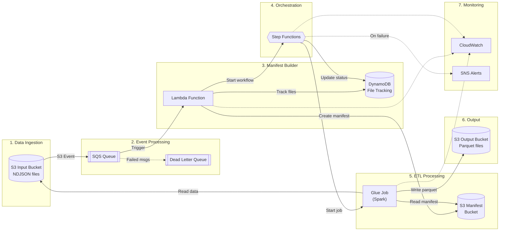
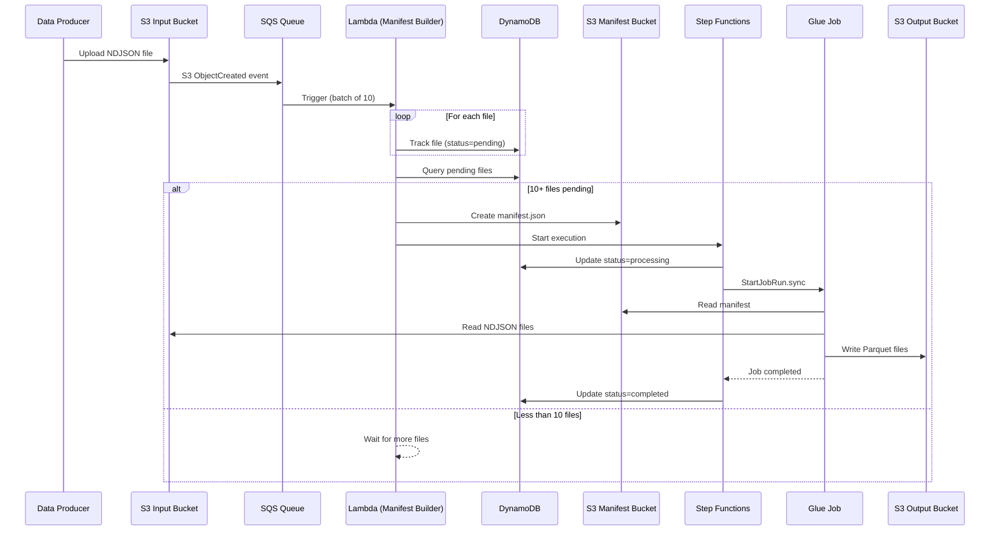

# NDJSON to Parquet Pipeline Architecture

## Overview

This pipeline converts NDJSON files to Parquet format using AWS serverless services.

## Architecture Diagram (Mermaid)



## Data Flow Diagram (Mermaid)



## Component Details

| Component | AWS Service | Purpose |
|-----------|-------------|---------|
| Input Bucket | S3 | Receives NDJSON files |
| Event Queue | SQS | Buffers S3 events, enables batching |
| Dead Letter Queue | SQS | Captures failed messages |
| Manifest Builder | Lambda | Tracks files, creates manifests |
| File Tracking | DynamoDB | Stores file metadata and status |
| Manifest Bucket | S3 | Stores manifest JSON files |
| Workflow | Step Functions | Orchestrates Glue job execution |
| ETL Job | Glue | Converts NDJSON to Parquet |
| Output Bucket | S3 | Stores Parquet files |
| Monitoring | CloudWatch | Logs and metrics |
| Alerts | SNS | Failure notifications |

## File Flow

```
Input:  s3://input-bucket/pipeline/input/2025-01-17-file001.ndjson
                    ↓
Manifest: s3://manifest-bucket/manifests/2025-01-17/batch-0001.json
                    ↓
Output: s3://output-bucket/pipeline/output/year=2025/month=01/day=17/part-00000.snappy.parquet
```

## How to Generate PNG Diagrams

### Option 1: Python Diagrams Library

```bash
# Install
pip install diagrams

# Generate
cd docs
python architecture_diagram.py
python data_flow_diagram.py
```

### Option 2: Mermaid Live Editor

1. Go to https://mermaid.live
2. Paste the Mermaid code from above
3. Export as PNG or SVG

### Option 3: Draw.io / Diagrams.net

1. Go to https://app.diagrams.net
2. Use AWS icon shapes library
3. Manually create the diagram

### Option 4: AWS Architecture Icons

Download official icons from:
https://aws.amazon.com/architecture/icons/
