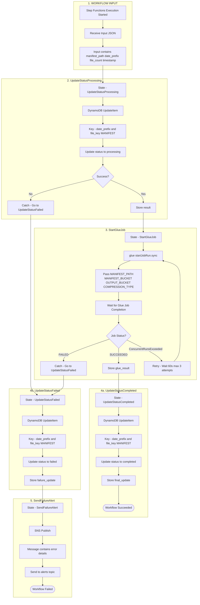
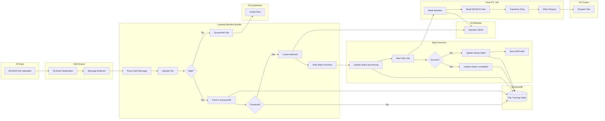
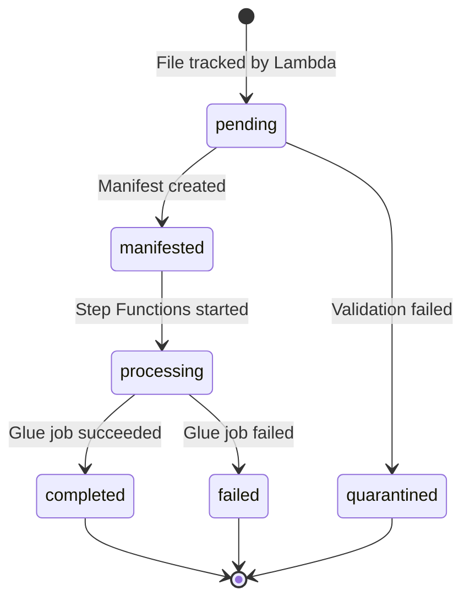
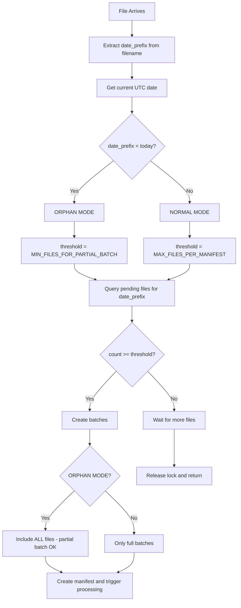

# Pipeline Execution Flowcharts

Detailed step-by-step flowcharts for Lambda, Step Functions, and Glue Job execution.

---

## 1. Lambda Manifest Builder Execution Flow

```mermaid
flowchart TD
    subgraph TRIGGER["1. SQS TRIGGER"]
        A[SQS Message Received] --> B[Lambda Invoked]
        B --> C[Extract Records from Event]
        C --> D{Records Empty?}
        D -->|Yes| E[Return 200 - No records]
        D -->|No| F[Loop Through SQS Records]
    end

    subgraph PARSE["2. PARSE SQS MESSAGE"]
        F --> G[Parse JSON Body]
        G --> H[Extract S3 Event]
        H --> I[Get S3 Records Array]
        I --> J[Loop Through S3 Records]
    end

    subgraph EXTRACT["3. EXTRACT FILE INFO"]
        J --> K[Extract bucket name]
        K --> L[Extract object key]
        L --> M[Extract file size]
        M --> N[Log - Processing file]
    end

    subgraph VALIDATE["4. VALIDATE FILE"]
        N --> O{Extension .ndjson?}
        O -->|No| P[Validation Failed - Invalid extension]
        O -->|Yes| Q[Calculate size in MB]
        Q --> R{Size within tolerance?}
        R -->|No| S[Validation Failed - Size out of range]
        R -->|Yes| T[Validation Passed]
    end

    subgraph QUARANTINE["5. QUARANTINE INVALID FILES"]
        P --> U{QUARANTINE_BUCKET set?}
        S --> U
        U -->|No| V[Log Warning - Skipping quarantine]
        U -->|Yes| W[Copy file to quarantine bucket]
        W --> X[Add metadata]
        V --> Y[Return quarantined]
        X --> Y
    end

    subgraph DATE_EXTRACT["6. EXTRACT DATE FROM FILENAME"]
        T --> Z[Split key by slash]
        Z --> AA[Get filename from last part]
        AA --> AB{Regex match YYYY-MM-DD?}
        AB -->|Yes| AC[Use matched date as date_prefix]
        AB -->|No| AD[Use current UTC date]
        AD --> AE[Log Warning - No date found]
        AC --> AF[Return date_prefix and filename]
        AE --> AF
    end

    subgraph TRACK["7. TRACK FILE IN DYNAMODB"]
        AF --> AG[Create item dict]
        AG --> AH[Set date_prefix]
        AH --> AI[Set file_key equals filename]
        AI --> AJ[Set file_path]
        AJ --> AK[Set file_size_mb]
        AK --> AL[Set status equals pending]
        AL --> AM[Set created_at]
        AM --> AN[DynamoDB PutItem]
        AN --> AO[Log - File tracked]
    end

    subgraph LOCK["8. ACQUIRE DISTRIBUTED LOCK"]
        AO --> AP[Create lock key]
        AP --> AQ[Generate unique lock_id]
        AQ --> AR[Calculate TTL]
        AR --> AS[DynamoDB PutItem with condition]
        AS --> AT{Lock acquired?}
        AT -->|No| AU[Log - Another process handling]
        AT -->|Yes| AV[Log - Lock acquired]
        AU --> AW[Return 0 manifests]
    end

    subgraph CHECK["9. CHECK BATCH THRESHOLD"]
        AV --> AX[Query DynamoDB for pending files]
        AX --> AY[Filter by date_prefix]
        AY --> AZ[Get total pending count]
        AZ --> BA{date_prefix before today?}
        BA -->|Yes| BB[ORPHAN FLUSH MODE]
        BA -->|No| BC[NORMAL MODE]
        BB --> BD[Use MIN threshold]
        BC --> BE[Use MAX threshold]
        BD --> BF{count >= threshold?}
        BE --> BF
        BF -->|No| BG[Log - Not enough files]
        BF -->|Yes| BH[Proceed to create batches]
        BG --> BI[Release lock]
        BI --> AW
    end

    subgraph BATCH["10. CREATE BATCHES"]
        BH --> BJ[Split files into batches]
        BJ --> BK{ORPHAN MODE?}
        BK -->|Yes| BL[Include partial batches]
        BK -->|No| BM[Only full batches]
        BL --> BN[Return batches array]
        BM --> BN
    end

    subgraph MANIFEST["11. CREATE MANIFEST"]
        BN --> BO[Loop through batches]
        BO --> BP[Generate manifest key]
        BP --> BQ[Build manifest JSON]
        BQ --> BR[Add URIPrefixes]
        BR --> BS[S3 PutObject]
        BS --> BT[Log - Manifest uploaded]
    end

    subgraph UPDATE["12. UPDATE FILE STATUS"]
        BT --> BU[Loop through batch files]
        BU --> BV[DynamoDB UpdateItem]
        BV --> BW[Set status equals manifested]
        BW --> BX[Set manifest_path]
        BX --> BY[Set updated_at]
        BY --> BZ[Log - Updated file statuses]
    end

    subgraph STEPFN["13. TRIGGER STEP FUNCTIONS"]
        BZ --> CA{STEP_FUNCTION_ARN set?}
        CA -->|No| CB[Log Warning - Skipping trigger]
        CA -->|Yes| CC[Build input JSON]
        CC --> CD[Add manifest_path date_prefix file_count]
        CD --> CE[start_execution]
        CE --> CF[Log - Started execution]
        CF --> CG[Release lock]
        CB --> CG
        CG --> CH[Return manifests_created count]
    end

    subgraph SUMMARY["14. RETURN SUMMARY"]
        Y --> CI[Increment quarantined count]
        CH --> CJ[Increment processed count]
        CI --> CK[Continue to next file]
        CJ --> CK
        CK --> CL{More files?}
        CL -->|Yes| J
        CL -->|No| CM[Log Processing Summary]
        CM --> CN[Return statusCode and body]
    end

    E --> ENDNODE([End])
    CN --> ENDNODE
```



---

## 2. Step Functions Workflow Execution Flow



---

## 3. Glue ETL Job Execution Flow

```mermaid
flowchart TD
    subgraph INIT["1. JOB INITIALIZATION"]
        A[Glue Job Started] --> B[Parse Arguments]
        B --> C[Get JOB_NAME MANIFEST_BUCKET OUTPUT_BUCKET COMPRESSION_TYPE MANIFEST_PATH]
        C --> D[Initialize SparkContext]
        D --> E[Create GlueContext]
        E --> F[Get SparkSession]
        F --> G[Initialize Job]
    end

    subgraph CONFIG["2. SPARK CONFIGURATION"]
        G --> H[Configure Spark Settings]
        H --> I[Set adaptive enabled and compression codec]
        I --> J[Initialize ManifestProcessor]
    end

    subgraph READ_MANIFEST["3. READ MANIFEST"]
        J --> K[Parse manifest S3 path]
        K --> L[Extract bucket and key]
        L --> M[S3 GetObject]
        M --> N[Parse manifest JSON]
        N --> O[Extract fileLocations]
        O --> P[Get URIPrefixes array]
        P --> Q[List of file paths ready]
    end

    subgraph EXTRACT_DATE["4. EXTRACT DATE PREFIX"]
        Q --> R[Parse manifest key path]
        R --> S[Split by slash]
        S --> T{Date in path?}
        T -->|Yes| U[Use path date as date_prefix]
        T -->|No| V[Use current UTC date]
        U --> W[date_prefix ready]
        V --> W
    end

    subgraph READ_NDJSON["5. READ NDJSON FILES"]
        W --> X[spark.read.json with file_paths]
        X --> Y[multiLine equals False]
        Y --> Z[Read all files into DataFrame]
        Z --> ZA{DataFrame empty?}
        ZA -->|Yes| ZB[Log Warning - No data]
        ZA -->|No| ZC[Add metadata columns]
        ZC --> ZD[Add _processing_timestamp]
        ZD --> ZE[Add _source_file]
        ZE --> ZF[Count records]
        ZF --> ZG[Log - Read N records]
    end

    subgraph TRANSFORM["6. TRANSFORM DATA"]
        ZG --> ZH[Cast all columns to String]
        ZH --> ZI[Loop through columns]
        ZI --> ZJ[Apply StringType cast]
        ZJ --> ZK[Select transformed columns]
        ZK --> ZL[DataFrame ready for write]
    end

    subgraph PARTITION["7. CALCULATE PARTITIONS"]
        ZL --> ZM[Cache DataFrame]
        ZM --> ZN[Count total records]
        ZN --> ZO[Estimate size in MB]
        ZO --> ZP[Calculate optimal partitions]
        ZP --> ZQ[num_partitions equals max of size_mb div 128 or 1]
        ZQ --> ZR[Coalesce DataFrame]
    end

    subgraph WRITE_PARQUET["8. WRITE PARQUET"]
        ZR --> ZS[Generate output path]
        ZS --> ZT[Path is merged-parquet-date_prefix]
        ZT --> ZU[Write Parquet]
        ZU --> ZV[Mode append compression snappy]
        ZV --> ZW{Write successful?}
        ZW -->|Yes| ZX[Log - Wrote N records]
        ZW -->|No| ZY[Log Error - Write failed]
        ZY --> ZZ[Raise Exception]
    end

    subgraph CLEANUP["9. CLEANUP AND COMMIT"]
        ZX --> AAA[Unpersist cached DataFrame]
        AAA --> AAB[Update stats]
        AAB --> AAC[Increment batches_processed and records_processed]
        AAC --> AAD[Log - Job completed]
        AAD --> AAE[Log - Final stats JSON]
        AAE --> AAF[job.commit]
        AAF --> AAG[Stop SparkContext]
        AAG --> AAH([Job Succeeded])
    end

    subgraph ERROR_HANDLING["ERROR HANDLING"]
        ZB --> ABI[Return early]
        ZZ --> ABJ[Log - Job failed]
        ABJ --> ABK[Stop SparkContext]
        ABK --> ABL([Job Failed])
        ABI --> AAG
    end
```



---

## 4. Complete Pipeline Flow - End to End



---

## 5. DynamoDB State Transitions



---

## 6. Orphan Flush Decision Flow



---

## Viewing These Diagrams

### Option 1: GitHub or GitLab
These Mermaid diagrams render automatically in GitHub and GitLab markdown preview.

### Option 2: VS Code
Install the Markdown Preview Mermaid Support extension.

### Option 3: Mermaid Live Editor
1. Go to https://mermaid.live
2. Paste the diagram code
3. Export as PNG or SVG

### Option 4: Generate Images
```bash
# Install mermaid-cli
npm install -g @mermaid-js/mermaid-cli

# Generate PNG
mmdc -i EXECUTION-FLOWCHARTS.md -o flowchart.png
```
